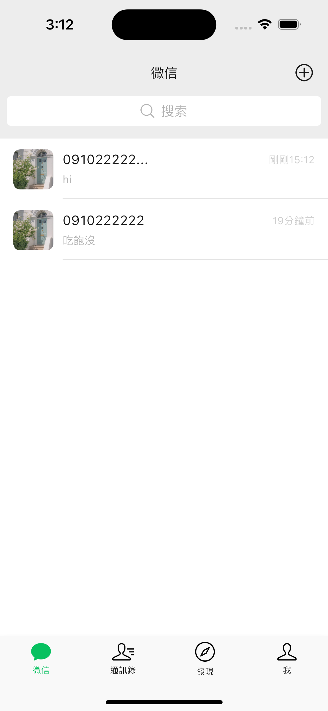

Flutter仿照微信做的APP
-------------
除了UI設計還完成下列功能
1. 電話登入
2. 添加朋友
3. 選擇好友創建多人聊天
4. 1對1文字聊天功能
5. 多人文字聊天功能
6. 聊天中可傳送圖片功能

| 首頁 | 登入頁面 |
| :----: | :----: |
|  | |

| 發現頁面 | 我頁面| 
| :----: | :----: | 
|  | | 

| 微信頁面 | 微信-添加朋友| 
| :----: | :----: | 
|  | | 

| 微信-添加朋友 | 微信-發起聊天-選擇聯繫人| 
| :----: | :----: | 
|  | | 

| 我頁面-個人信息 | 我頁面-個人信息-我的二維碼| 
| :----: | :----: | 
|  | | 

| 通訊錄頁面 | 聊天頁面| 
| :----: | :----: | 
|  | | 

| 多人聊天-更多功能1 | 多人聊天-更多功能2| 
| :----: | :----: | 
|  | | 

| 單人聊天-更多功能 | 
| :----: |
|  | 

        
